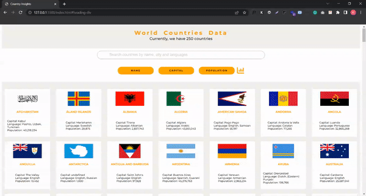

# CountryInsights
Country Insights is a dynamic web application that empowers users to explore and gain in-depth knowledge about countries around the globe. With its intuitive search functionality, users can effortlessly search and access detailed insights on any country of their choice.

## Demo

## Usage
1. Enter the name of the country you wish to search for in the designated input field.
2. Select the desired sorting option to refine your search results. You can choose to sort the results in ascending or descending order based on the country name, capital, or population.
3. Explore the refined search results to access detailed information about the countries that match your search criteria.
4. To further enhance your understanding, take advantage of the captivating visualizations and interactive charts that showcase the most spoken languages and their corresponding populations.
